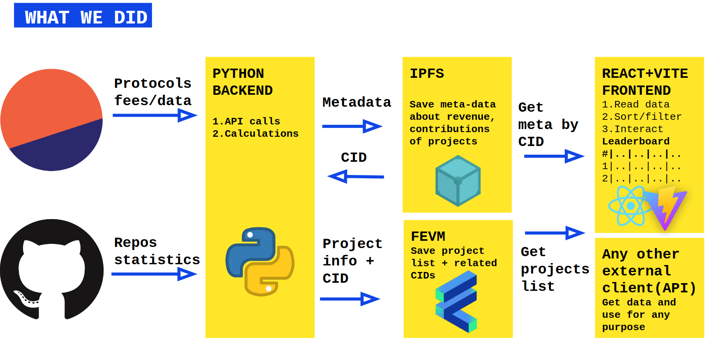

  

Application URL: https://newRoyalty.matthewheartful.repl.co

##### Table of Contents
- [Description](#description)
    * [Problem](#problem)
    * [Insight](#insight)
    * [Solution](#solution)
- [Architecture and used dependencies](#architecture-and-used-dependencies)
    * [Current state](#current-state)
    * [Potential further improvements](#potential-further-improvements)

## Description
0xRoyalty is a developer leaderboard (linking protocol commercial results to developer contributions).
### Problem
While top web3 protocols make billions, developers don’t get deserved credit, nor royalties.
### Insight
Most projects are forks. And all code contributions are traceable and public.
### Solution
We build Trustless reputation system for developers, algorithm + datasets.
Every developer can propose improvements to reputation algorithm. Everyone can supply new datasets to feed reputation algorithm.

## Architecture and used dependencies
### Current state

* Our backend is gathering all necessary statistics like web3 app/protocol usage and feed, statistics about contribution from the related GitHub repositories.
* Then metadata about the project is uploaded to the [IPFS](https://ipfs.io/)
* Project information added/updated on-chain with our smart contract written for FEVM 
* Any client (like our frontend) could retrieve the data about all projects tracked from the smart contract + all meta information about particular project from [IPFS](https://ipfs.io/)

### Potential further improvements
* Support more stats providers except Dune. + consider our own on-chain analytics.
* Support not only GitHub.
* Add community engagements like votings, common community driven lists of projects etc.
* Add options to integrate with existing DAO tooling. 

